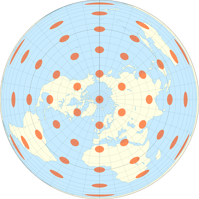

```{r setup, include=FALSE}
knitr::opts_chunk$set(echo = TRUE, collapse = TRUE)
```

---

Cet atelier se veut un survol des outils disponibles en R pour l'analyse de données géoréférencées. Ce type de données apparaît de plus en plus fréquemment dans divers domaines (ex.: photos aériennes, images satellite, données du recensement, lieux rattachés aux messages sur les réseaux sociaux, etc.). Il existe deux grandes catégories de données géoréférencées:

* les données matricielles représentent des variables définies à chaque point d'une grille couvrant tout l'espace représenté (comme une image satellite);
* les données vectorielles associent des variables à des objets géométriques placés à des endroits précis (comme la position des villes et des chemins sur une carte routière).

Au départ, l'utilisation de commandes de programmation pour manipuler des données géographiques peut sembler moins intuitif que l'interface graphique de logiciels spécialisés (ex.: ArcGIS). Voici quelques avantages d'une analyse programmée:

* Il est facile de répéter l'analyse pour de nouvelles données en ré-exécutant le programme.
* Il est facile pour d'autres chercheurs de reproduire la méthodologie s'ils ont accès au même langage de programmation.
* Dans le cas spécifique de R, on peut extraire des variables spatiales et les combiner à d'autres analyses statistiques avec un seul programme.


## Objectifs

* Se familiariser avec les principaux packages permettant le traitement et la visualisation simple de données vectorielles (***sf***) et matricielles (***stars***) en R. 
* Effectuer des transformations de données courantes à l'aide des fonctions de ces packages.
* Connaître certains packages permettant des visualisations plus complexes: ***ggplot2*** pour des cartes statiques et ***mapview*** pour des cartes interactives.

### Note sur les packages

L'ensemble des packages disponibles pour l'analyse spatiale en R évolue rapidement. Il y a quelques années, les packages  ***sp*** and ***raster*** étaient les principaux outils pour l'analyse des données vectorielles et matricielles, respectivement. ***sf*** et ***stars*** font partie d'une initiative récente pour faciliter le traitement des données spatiales dans R ([https://www.r-spatial.org/](https://www.r-spatial.org/)). Le package ***sf*** représente les tableaux de données spatiaux selon un format standard basé sur les bases de données géospatiales et s'intègre bien avec des packages populaires pour la manipulation et la visualisation des données (notamment ***dplyr*** et ***ggplot2***). Le package ***stars*** est plus récent, mais présente déjà certains avantages par rapport à ***raster***. Une [version précédente](https://pmarchand1.github.io/atelier_rgeo/atelier_rgeo.html) de cet ateiler utilisait ***raster*** plutôt que ***stars***.

## Table des matières

* [Explorer un jeu de données vectoriel](#vect)
* [Systèmes de coordonnées et transformations](#crs)
* [Cartes détaillées avec ggplot2](#geomsf)
* [Opérations géométriques sur les données vectorielles](#vectop)
* [Traitement des données matricielles](#rast)
* [Cartes interactives avec *mapview*](#mapview)
* [Références supplémentaires](#ref)
* [Sources des données](#data)
* [Solutions des exercices](#sol)

---

## Explorer un jeu de données vectoriel {#vect}

Tous les jeux de données de cet atelier se trouvent dans le répertoire *data*. Le jeu de données *mrc* contient les coordonnées des municipalités régionales de comté (MRC) du Québec en format *ESRI shapefile*. Notez que l'information pour chaque jeu de données est contenue dans plusieurs fichiers, qui portent le même nom mais diffèrent par leur extension (*mrc.dbf*, *mrc.prj*, *mrc.shp* and *mrc.shx*). 

Pour charger un jeu de données dans R, nous appelons la fonction `st_read` (toutes les fonctions du package ***sf*** ont le préfixe `st_`, pour spatiotemporel). Le premier argument de `st_read` est le chemin vers le fichier de données. L'argument `stringsAsFactors = FALSE` évite que R ne convertisse les variables textuelles en facteur dans le tableau de données résultant.

```{r read_mrc}
library(sf)

mrc <- st_read("data/mrc.shp", stringsAsFactors = FALSE)
```

Le texte de sortie indique certaines propriétés du jeu de données chargé, incluant le type de géométrie (MULTIPOLYGON), les limites spatiales du jeu de données (*bbox*) et le système de coordonnées utilisé. Ce dernier est décrit sous deux formats: un code numérique *epsg* et une chaîne de caractère *proj4string*. Nous traiterons davantage des systèmes de coordonnées plus loin. Notons pour l'instant que "+proj=longlat" dans la *proj4string* signifie que les données sont en degrés de longitude et latitude.

Les limites spatiales et le système de coordonnées (CRS) peuvent être extraits séparément à l'aide des fonctions `st_bbox` et `st_crs`:
```{r bbox_crs}
st_bbox(mrc)
st_crs(mrc)
```

Regardons un aperçu du jeu de données:
```{r class_head}
class(mrc)
head(mrc)
```

Un objet de classe `sf` est en fait un `data.frame` spécialisé, où chaque ligne contient des champs de données qui sont associés à un élément géométrique, décrit dans la colonne `geometry`. Les types géométriques les plus courants sont:

* POINT: Coordonnées (*x*, *y*) d'un point.
* LINESTRING: Séquence de points reliés par des segments de droite.
* POLYGON: Séquence de points formant un polygone simple fermé.
* MULTIPOINT, MULTILINESTRING ou MULTIPOLYGON: Jeu de données où chaque élément peut être composé de plusieurs points ou lignes ou polygones.

La fonction `plot` appliquée à un objet `sf` crée une carte de chaque attribut du jeu de données.

```{r plot_sf}
plot(mrc)
```

Pour n'afficher qu'un attribut, il faut sélectionner la colonne correspondante. Pour n'afficher que la carte sans données, on peut choisir la colonne `geometry`. Le paramètre `axes = TRUE` indique au programme d'afficher les axes de coordonnées.

```{r plot_geom}
plot(mrc[, "geometry"], axes = TRUE)
```

Vous pouvez choisir une partie des rangées ou des colonnes d'un objet `sf` comme s'il s'agissait d'un `data.frame` régulier.

```{r sf_subset}
# Choisir la 5e rangée
mrc[5, ]
# Choisir le nom et la population de la MRC pour les MRC avec une population de 200 000 et plus
mrc[mrc$pop2016 > 200000, c("mrc_name", "pop2016")] 
```

Notez que la colonne contenant l'information spatiale (*geometry*) demeure toujours dans le tableau, même si elle n'est pas choisie. Pour éliminer cette colonne et convertir l'objet `sf` en tableau de données régulier, vous pouvez utiliser la fonction `st_drop_geometry`.

### Exercice 1 {#retour1}

Choisissez les MRC de la région du Bas-St-Laurent (*reg_id*: 01) et de la Gaspésie (*reg_id*: 11), puis affichez leur population de 2016 sur une carte.
*Indice*: L'opérateur `%in%` permet de vérifier si une variable prend une valeur parmi une liste. Par exemple, `x %in% c(1, 3)` est égal à TRUE si *x = 1* ou *x = 3*.

[Solution](#sol1)

### Intégration avec le package dplyr

Les fonctions de manipulation de données du package ***dplyr*** fonctionnent aussi sur des objets `sf`. Par exemple, nous pouvons réécrire l'exemple ci-dessus (choisir le nom et la population des MRC avec une population de plus de 200 000) avec `filter` et `select`.

```{r sf_dplyr}
library(dplyr)

filter(mrc, pop2016 > 200000) %>%
    select(mrc_name, pop2016)
```

Lorsque nous calculons une statistique sommaire par groupe, les éléments géométriques sont aussi soudés pour chaque groupe. Pour illustrer ce point, regroupons les MRC et leur population par région.

```{r sf_groupby}
regions <- group_by(mrc, reg_name) %>%
    summarize(pop2016 = sum(pop2016))
head(regions)
plot(regions["pop2016"])
```

### Créer un objet spatial à partir d'un *data frame*

Le fichier `plots.csv` contient des données sur les placettes d'inventaire du Ministère des Forêts, de la Faune et des Parcs du Québec (MFFP), incluant le numéro d'identification, la latitude et la longitude, la date d'inventaire, le type de couvert (feuillu, mixte ou confière) ainsi que la classe de hauteur. 

```{r load_plots}
plots <- read.csv("data/plots.csv", stringsAsFactors = FALSE)
head(plots)
```

Nous pouvons convertir ces données en objet `sf` avec la fonction `st_as_sf`. L'argument `coords` indique quelles colonnes contiennent les coordonnées X et Y, tandis que `crs` spécifie le système de coordonnées utilisé.

```{r df_to_sf}
plots <- st_as_sf(plots, coords = c("long", "lat"), crs = st_crs(mrc))
plot(plots["geometry"])
```

### Rappel

* Les données spatiales vectorielles associent des champs de donnés à des objets géométriques tels que des points, lignes et polygones. Le package ***sf*** permet de travailler avec ces données dans R.
* Pour lire un jeu de données vectoriel: `st_read`.
* Pour convertir un jeu de données standard (`data.frame`) en objet spatial: `st_as_sf`.
* Toutes les opérations de base des objets `data.frame`, ainsi que les fonctions du package ***dplyr***, s'appliquent aussi aux objets `sf`.
* La fonction `plot` appliquée à un objet `sf` permet d'afficher un ou plusieurs champs de données sur une carte.

---

## Systèmes de coordonnées et transformations {#crs}

Jusqu'à présent, nous avons travaillé avec des données utilisant un système de coordonnées géographiques, où les positions sont exprimées en degrés de longitude et latitude. Ces coordonnées sont basées sur un modèle qui approxime la surface irrégulière du niveau moyen de la mer autour de la Terre (appelée géoïde) par une ellipsoïde (une sphère légèrement aplatie). Ce modèle géodésique est le *datum* dans la description du système de coordonnées: les coordonnées de `mrc` sont définies avec le système NAD83 (Amérique du Nord), tandis que plusieurs cartes à l'échelle mondiale sont basées sur le système WGS84.

```{r st_crs}
st_crs(mrc)
```

Une projection convertit les coordonnées géographiques en coordonnées planes (X, Y). Puisqu'il est impossible de représenter fidèlement la surface entière du globe sur un plan, des projections spécialisées ont été développées en fonction de la région du monde et des besoins précis. 

Par exemple, les images ci-dessous montrent comment des aires circulaires identiques à différents points du globe apparaissent sur une projection de Mercator (formes comparables) et sur une projection équivalente de Lambert (aires comparables).

 

Nous allons convertir les polygones `mrc` dans une projection
conique conforme de Lambert centrée sur le Québec ([code EPSG: 6622](https://epsg.io/6622)), en utilisant la fonction `st_transform`.

```{r transform}
mrc_proj <- st_transform(mrc, crs = 6622)
st_crs(mrc_proj)
```

Les codes EPSG permettent de spécifier rapidement une projection, tandis que la *proj4string* contient de l'information plus détaillée sur le type de projection (*lcc* signifie *Lambert conical conformal*) et ses paramètres. Notez que les coordonnées projetées sont exprimées en mètres ("+units=m" dans la *proj4string*). Ces coordonnées sont relatives à un point d'origine défini par la projection.

```{r plot_geom_proj}
plot(mrc_proj["geometry"], axes = TRUE)
```

On peut créer une carte montrant les lignes de latitude et longitude superposées aux données projetées, avec le paramètre `graticule` auquel on associe le système de coordonnées géographique des données originales:

```{r plot_graticule}
plot(mrc_proj["geometry"], axes = TRUE, graticule = st_crs(mrc))
```

Il est important de toujours utiliser la fonction `st_transform` pour convertir des jeux de données entre différents système de coordonnées. Une erreur courante consiste à changer la définition du système de coordonnées (par exemple, avec la fonction`st_crs`) sans transformer les données elles-mêmes.

### Rappel

* Un système de coordonnées géographique est basé sur un modèle géodésique (*datum*) et donne la position en coordonnées sphériques (longitude, latitude) mesurées en degrés.
* Un système de coordonnées projeté convertit les coordonnées sphériques en coordonnées planes (*x*, *y*) mesurées en mètres.
* `st_crs` indique le système de coordonnées d'un objet `sf`; `st_transform` convertit les coordonnées d'un système à un autre.

---

## Cartes détaillées avec ggplot2 {#geomsf}

Bien que la fonction `plot` soit utile pour obtenir une vue d'ensemble d'un jeu de données spatiales, d'autres packages offrent davantage d'options pour créer des cartes détaillées. Dans cette section, nous verrons comment un package populaire de graphiques en R, ***ggplot2***, prend également en charge la cartographie de jeux de données spatiales.

Pour ceux qui ne connaissent pas ***ggplot2***, une introduction complète est disponible dans le chapitre [Data visualisation](https://r4ds.had.co.nz/data-visualisation.html) du livre *R for Data Science* (Wickham et Grolemund). Tous les graphiques ***ggplot2*** requièrent les mêmes étapes:

* Spécifier le jeu de données ainsi que les correspondances esthétiques (`aes`), qui associent les variables du jeu de données à des éléments graphiques (axes *x* et *y*, échelle de couleur ou de taille, etc.);
* Ajouter les couches `geom_`, qui spécifient le type de graphique;
* Au besoin, spécifier des options de personnalisation supplémentaires, telles que les noms et limites d'axes, les thèmes de couleur, etc.

Par exemple, le code suivant crée un graphique en barres (`geom_bar`) à partir des données de parcelles d’inventaire forestier (`data = plots`), indiquant le nombre de parcelles forestières par classe de hauteur (axe *x*) et par type de couverture (*fill*, remplissage des barres). La fonction `labs` définit des titres personnalisés pour le graphique, les axes et la légende.

```{r ggplot_bar}
library(ggplot2)

ggplot(data = plots, aes(x = height_cls, fill = cover_type)) + 
    geom_bar() +
    labs(title = "Forest inventory plots", x = "Height class", 
         y = "Count", fill = "Cover type")
```

Lorsque le jeu de données est un objet `sf`, nous utilisons la fonction `geom_sf` pour afficher les éléments géométriques sur une carte. Il n'est pas nécessaire de spécifier les correspondances *x* et *y* dans `aes`, car celles-ci sont définis par l'objet `sf` lui-même. Les lignes du graticule sont dessinées automatiquement.

```{r geom_sf}
ggplot(data = mrc_proj) +
    geom_sf()
```

Pour ajouter plusieurs couches spatiales à la même carte, nous ajoutons simplement plusieurs `geom_sf`, qui peuvent être basés sur différents jeux de données (en spécifiant l'argument `data` dans chaque `geom`). Dans le code ci-dessous, nous ajoutons une couche de points pour les placettes d’inventaire forestier, en attribuant l’esthétique de la couleur au type de couvert. Nous passons également du thème gris par défaut au thème noir et blanc, `theme_bw`.

```{r geom_sf_mult}
ggplot() +
    geom_sf(data = mrc_proj) +
    geom_sf(data = plots, aes(color = cover_type), size = 1) +
    theme_bw()
```

Lorsqu'un élément graphique est défini comme une constante en dehors de la fonction `aes`, il s'applique à toute la couche; donc `size = 1` indique que tous les points sont de taille 1.

Remarquez que les deux jeux de données utilisent des systèmes de coordonnées différents:

```{r}
st_crs(mrc_proj)
st_crs(plots)
```

Dans ce cas, ***ggplot2*** transforme automatiquement toutes les couches en un même CRS. Par défaut, il s'agit du CRS du premier jeu de données, mais un autre CRS peut être spécifié avec la fonction `coord_sf`.

```{r ggplot_crs}
ggplot(data = plots) +
    geom_sf() +
    coord_sf(crs = 6622)
```

De plus, `coord_sf` peut servir à choisir les limites de chaque axe, pour "zoomer" sur une portion de la carte.

```{r coord_sf}
ggplot(data = regions) +
    geom_sf(aes(fill = pop2016)) +
    geom_sf_label(aes(label = reg_name)) +
    coord_sf(xlim = c(-75, -70), ylim = c(45, 47))
```

Ce dernier exemple présente un nouveau geom `geom_sf_label`, qui ajoute une étiquette de texte à chaque entité en fonction d'une valeur définie par l'élément `label`. `geom_sf_text` est semblable, mais omet le rectangle blanc autour de l'étiquette de texte.

### Exercice 2 {#retour2}

Créez une carte des MRC avec des couleurs de remplissage différentes pour chaque région.

[Solution](#sol2)


### Rappel

* Un graphique ***ggplot2*** commence par un appel à la fonction `ggplot()`, suivi d'un `geom` spécifique définissant chaque couche du graphique, suivi optionnellement de fonctions de personnalisation.
* L'argument `data` spécifie un jeu de données et la fonction `aes` associe les variables de ce jeu de données à des éléments graphiques. Ces argument peuvent être définis dans la fonction `ggplot` (s'ils s'appliquent à toutes les couches) ou dans des couches `geom` spécifiques.
* La couche `geom_sf` ajoute les objets `sf` sur une carte.
* Les couches `geom_sf_text` ou` geom_sf_label` ajoutent des données textuelles à chaque entité spatiale d'une carte.
* La fonction `coord_sf` définit les limites des axes et le CRS à utiliser, transformant toutes les entités spatiales dans ce CRS. Par défaut, le CRS du premier jeu de données spatial est utilisé.

### Autres packages pour les cartes

Le package ***tmap*** (voir [ce tutoriel](https://cran.r-project.org/web/packages/tmap/vignettes/tmap-getstarted.html)) permet aussi de produire des cartes dans R. Il a été développé avant que ***ggplot2*** ne prenne en charge les objets `sf` et sa syntaxe ressemble à celle de ***ggplot2***.

---

## Opérations géométriques sur les données vectorielles {#vectop}

Le package ***sf*** inclut un certain nombre d'opérations géométriques pour les données vectorielles, similaires à celles des bases de données géographiques ou des logiciels SIG. Ces opérations peuvent être regroupées en trois classes:

* des prédicats ou tests, dont la sortie est TRUE/FALSE (ex.: la géométrie A est-elle contenue dans B?);
* des mesures, qui produisent une quantité scalaire (par exemple, la longueur d'une ligne, l'aire d'un polygone, la distance entre deux géométries);
* des fonctions génératrices de géométries qui produisent des géométries en sortie basées sur l'entrée (par exemple, distance tampon autour d'un point, centroïde d'un polygone, intersection de deux lignes ou polygones).

Dans cet atelier, nous présenterons quelques exemples de chaque classe. Pour une présentation plus détaillée, voir le chapitre 5 du livre *Spatial Data Science* figurant dans les [références supplémentaires](#ref).

Tout d'abord, nous utilisons `st_area` pour calculer la surface de chaque MRC dans le jeu de données original.

```{r st_area}
areas <- st_area(mrc)
head(areas)
```

Notez que la réponse est exprimée en mètres carrés, même si `mrc` utilise des coordonnées géographiques. Trois fonctions de mesure: `st_area`,` st_length` et `st_distance` implémentent des mesures géodésiques qui prennent en compte la courbure de la Terre. Ce n'est pas le cas pour d'autres opérations, comme nous le verrons plus loin.

Pour faciliter la lecture des résultats, nous pouvons les convertir en une unité différente.

```{r units_areas}
units(areas) <- "km^2"
head(areas)
```

Comme exemple de prédicat, vérifions quels points dans `plots` ont une intersection (un point en commun) avec des polygones dans `mrc`.

```{r st_intersects}
inters <- st_intersects(plots, mrc)
inters[1:3] # regarder les trois premiers éléments
```

Lorsque l'on compare deux objets spatiaux avec un prédicat tel que `st_intersects`, le résultat est une liste de la même longueur que le premier objet (ici,` plots`). Chaque élément de cette liste contient les indices des éléments du deuxième objet pour lequel le prédicat est vrai. Dans cet exemple, le premier élément de la liste (`[[1]]`) indique que la parcelle 1 intersecte avec la MRC 94, le troisième élément indique que la parcelle 3 intersecte avec la MRC 53, etc. Ici, chaque parcelle intersecte avec une seule MRC, mais en général, un élément de l'intersection peut être vide (si cet élément du premier objet n'a pas d'intersection avec le second objet) ou contenir plusieurs indices (si cet élément chevauche plusieurs éléments dans l'objet 2).

Le texte d'avertissement:

"although coordinates are longitude/latitude, st_intersects assumes that they are planar",

indique que cette fonction traite les coordonnées géographiques comme s'il s'agissait de coordonnées X-Y sur un plan. En particulier, les limites d'un polygone ne sont pas les lignes les plus courtes entre ses sommets, car elles ignorent la courbure de la Terre. La différence est généralement mineure, à moins que les segments de ligne soient très longs, s’ils soient proches d’un pôle ou de la ligne internationale de changement de date (où la longitude passe de -180 à 180 degrés).

À partir des résultats de `st_intersects` ci-dessus, nous pourrions suivre les indices pour trouver le nom de la MRC dans laquelle se trouve chaque parcelle d'inventaire. Heureusement, il existe une fonction de jonction spatiale `st_join` qui automatise ce processus en ajoutant à un objet` sf` les champs de données d'un deuxième objet `sf` lorsqu'il y a intersection entre les éléments. 

```{r st_join}
plots_mrc <- st_join(plots, mrc)
head(plots_mrc)
```

Par défaut, `st_join` effectue une jonction "à gauche", c'est-à-dire qu'elle conserve toutes les rangées du premier jeu de données, ajoutant des valeurs manquantes *NA* pour les champs additionnels lorsqu'il n'y a pas d'intersection avec le deuxième jeu de données. Nous pouvons constater cela en faisant la jonction de `plots` avec les MRC des régions 01 et 11 (voir Exercice 1).

```{r st_join_left}
mrc_01_11 <- mrc[mrc$reg_id %in% c("01", "11"), ]
plots_01_11 <- st_join(plots, mrc_01_11)
head(plots_01_11)
```

Avec l'argument optionnel `left = FALSE`, nous conservons seulement les placettes situées dans les deux régions voulues.

```{r st_join_inner}
mrc_01_11 <- mrc[mrc$reg_id %in% c("01", "11"), ]
plots_01_11 <- st_join(plots, mrc_01_11, left = FALSE)

ggplot() +
    geom_sf(data = mrc_01_11) +
    geom_sf(data = plots_01_11) +
    theme_bw()
```

### Exercice 3 {#retour3}

Le fichier *data/tbe2016_gaspe.shp* contient une carte des régions défoliées par la tordeuse des bourgeons de l'épinette au Bas-St-Laurent et en Gaspésie en 2016. Le niveau de défoliation est représenté par un entier: 1 = léger, 2 = modéré et 3 = sévère.

a) Comment de placettes dans ces régions sont affectées à chaque niveau de défoliation? *Indice*: La fonction `table` est utile pour compter les effectifs de chaque valeur dans une colonne. 

b) Produisez une carte des régions défoliées situées dans la MRC de Kamouraska, avec les limites de la MRC.

[Solution](#sol3)


Enfin, considérons quelques fonctions génératrices de géométries. La fonction `st_buffer` crée une zone tampon à une distance définie de chaque élément d'un objet. Par exemple, nous pouvons définir un rayon de 5 km autour de chaque point dans `plots_01_11`. Cette fonction ne fonctionne pas avec les coordonnées géographiques (longitude et latitude), nous projetons donc d'abord les points en coordonnées EPSG 6622.

```{r st_buffer}
plots_proj <- st_transform(plots_01_11, crs = 6622)
plots_buffer <- st_buffer(plots_proj, dist = 5000)

ggplot() +
    geom_sf(data = plots_buffer, linetype = "dotted", fill = NA) +
    geom_sf(data = plots_proj) +
    theme_bw()
```

*Notes*

* La distance de tampon est définie dans les unités du CRS, ici en mètres.

* S'il s'agit d'une couche de polygones, une distance négative crée une zone tampon à l'intérieur du polygone.

Ensuite, nous verrons trois fonctions basées sur des opérations d'ensembles. Si *A* et *B* sont des éléments géométriques, leur union est la zone couverte par A ou B, leur intersection est la zone couverte par A et B, et la différence (A - B) est la zone couverte par A, mais pas B. Dans `sf`, ces opérations sont réalisées par` st_union`, `st_intersection` et` st_difference`. Si elles sont appliquées à deux objets `sf` (chacun d'entre eux contenant plusieurs éléments dans une colonne), alors la fonction calcule l'union, l'intersection ou la différence entre toutes les paires possibles d'un élément de A et d'un élément de B.

Appliquée à un seul objet `sf`, la fonction` st_union` fusionne tous les éléments de cet objet. Dans l'exemple suivant, `buffer_union` est un objet géométrique unique, un multipolygone qui couvre toutes les zones à 5 km ou moins d'une placette. Les variables, ou attributs, associées à des éléments individuels sont perdues lors de la fusion.

```{r st_union}
buffer_union <- st_union(plots_buffer)

ggplot(buffer_union) +
    geom_sf()
```

Nous pouvons utiliser `st_intersection` pour extraire les portions des polygones` mrc_01_11` situées à moins de 5 km d'une placette, c’est-à-dire dans `buffer_union`, et utiliser `st_difference` pour extraire des zones des polygones MRC plus loin d'une placette.

```{r st_inters_diff}
mrc_01_11_proj <- st_transform(mrc_01_11, crs = 6622)

mrc_inters <- st_intersection(mrc_01_11_proj, buffer_union)
mrc_diff <- st_difference(mrc_01_11_proj, buffer_union)

ggplot(mrc_inters) +
    geom_sf() +
    theme_bw()

ggplot(mrc_diff) +
    geom_sf() +
    theme_bw()
```

Notez que `st_intersection` et `st_difference` copient les champs des jeux de données d'origine (ici, uniquement à partir de `mrc_01_11_proj`, car` buffer_union` n'a aucune donnée associée). L'avertissement ("attribute variables are assumed to be spatially constant") nous rappelle que ces variables pourraient ne pas correspondre aux nouvelles géométries. Par exemple, la variable *pop2016* dans `mrc_inters` fait référence à la MRC d'origine et non à la partie extraite par `st_intersection`.

### Rappel

* Le package ***sf*** inclut des fonctions de mesure pour l'aire des polygones (`st_area`), la longueur d'une ligne (`st_length`) ou la distance entre des paires d'éléments géométriques (`st_distance`). Ces fonctions sont adaptées aux systèmes de coordonnées géographiques (long, lat) ou projetés.
* Toutes les autres opérations géométriques dans ***sf*** sont basées sur la géométrie plane. Elles traitent la longitude et la latitude comme s’il s’agissait d’axes perpendiculaires (x, y).
* `st_intersects (A, B)` est un exemple de *prédicat* spatial: pour chaque élément de *A*, la fonction renvoie les indices des éléments de *B* qui l'intersectent.
* `st_join (A, B)` prend un objet `sf` *A* et y ajoute les champs de données d'un second objet *B* pour chaque cas où l'élément de *A* intersecte avec un élément de *B*. Contrairement à `st_intersection` ci-dessous, les éléments géométriques eux-mêmes ne changent pas; le résultat conserve la géométrie de *A*.
* `st_intersection (A, B)` produit un jeu de données contenant toutes les régions où les éléments de *A* et *B* se chevauchent.
* `st_difference (A, B)` produit un jeu de données contenant la différence d'ensemble (zones couvertes par *A*, mais pas par *B*) pour chaque paires d'éléments de *A* et *B*.
* `st_union (A, B)` produit un jeu de données contenant les unions (zone couverte par *A* ou *B*) pour chaque paire d'éléments d'*A* et *B*. Lorsqu'un seul objet `sf` est fourni en entrée, `st_union` fusionne tous les éléments de cet objet en un seul.
* `st_buffer` produit de nouveaux éléments géométriques qui ajoutent un tampon d'une distance donnée autour des géométries originales.

---

## Traitement des données matricielles {#rast}

Le dossier *data* contient un fichier couvrant les sections 022B et 022C du [Modèle numérique d'élévation canadien](https://ouvert.canada.ca/data/fr/dataset/7f245e4d-76c2-4caa-951a-45d1d2051333) ou CDEM.

Le CDEM est un jeu de données matriciel; la superficie Canada est couverte par une grille régulière et le modèle associe une valeur d'élévation (en mètres) à chaque pixel de cette grille. Ce type de données est analogue à une image numérique (matrice rectangulaire de pixels), à laquelle sont ajoutées des métadonnées (résolution, étendue spatiale et système de coordonnées), de sorte que chaque pixel puisse être associé à des coordonnées géographiques.

La résolution de base du CDEM est de 1/4800 de degré et les données sont disponibles en sections de 2 degrés de longitude par 1 degré de latitude. Le fichier de données que nous utilisons dans cet atelier contient deux sections (4 degrés de longitude sur 1 degré de latitude), mais sa résolution a été réduite (1/1200 de degré ou 3 secondes d'arc) pour réduire le temps de traitement.

Nous chargeons d’abord le fichier CDEM avec la fonction `read_stars` du package ***stars*** (le nom est l’acronyme de *spatiotemporal arrays*) Cette fonction associe le jeu de données à un objet `stars`. En tapant le nom de l'objet sur la ligne de commande, vous obtenez un résumé des données et des métadonnées.

```{r read_stars}
library(stars)
cdem <- read_stars("data/cdem_022BC_3s.tif")
cdem
```

Les données CDEM ont un *attribut* (variable), l’élévation, qui varie de 2 à 1179 m pour cette section. Le tableau *dimensions* comprend une ligne pour chaque dimension de tableau, ici *x* et *y*. Les colonnes *from* et *to* indiquent la plage d'indices dans chaque dimension (4801 cellules en *x*, 1201 cellules en *y*), la colonne *offset* contient les coordonnées du coin supérieur gauche du raster (70 degrés Ouest, 49 degrés Nord), la colonne *delta* indique la taille de chaque cellule (1/1200 soit environ 0,000833 degrés) et la colonne *refsys* décrit le système de coordonnées.

*Notes*

* Le *delta* négatif pour *y* signifie que la latitude décroît du haut (nord) au bas (sud) de l'image.

* Bien que nous nous limitions aux rasters bidimensionnels dans cet atelier, l'un des avantages du package ***stars*** est qu'il intègre facilement des dimensions supplémentaires non-spatiales, telles que le temps ou la bande spectrale, qui apparaissent couramment dans données de télédétection.

Nous pouvons également déterminer l'étendue et le système de coordonnées de l'objet avec les mêmes méthodes que nous avons utilisées pour les objets `sf`.

```{r bbox_crs_stars}
st_bbox(cdem)
st_crs(cdem)
```

Nous pouvons extraire les valeurs d'élévation dans une matrice R régulière avec `cdem[[1]]`, qui extrait la première (ici, la seule) variable du fichier. Cependant, nous perdons ainsi les métadonnées.

```{r}
elev <- cdem[[1]]
str(elev)
```

### Visualiser des données matricielles

La fonction `plot` crée une image 2D rapide d'un jeu de données matricielles.

```{r plot_stars}
plot(cdem)
```

Nous pouvons également afficher un objet `stars` dans un graphique ***ggplot2*** avec la fonction `geom_stars`. Puisque le nombre de pixels de la couche peut être bien supérieur à la résolution de l'écran, il est utile d'appliquer un facteur de sous-échantillonnage (*downsample*) pour accélérer la visualisation. Ici, `downsample = 5` signifie qu’un pixel sur 5 est affiché.

```{r geom_stars}
ggplot() +
    geom_stars(data = cdem, downsample = 5) +
    geom_sf(data = mrc_01_11, color = "white", fill = NA) +
    scale_fill_viridis_c() +
    coord_sf(xlim = c(-70, -66), ylim = c(48, 49)) +
    theme_bw()
```

La fonction `plot` ci-dessus sous-échantillonne automatiquement les données en fonction de la résolution de l'écran.

### Travailler avec des fichiers volumineux

Pour les fichiers matriciels trop volumineux pour être chargés en mémoire, vous pouvez utiliser l'argument `proxy = TRUE` dans` read_stars`. Dans ce cas, R charge un objet `stars_proxy` contenant les métadonnées, mais pas les valeurs des pixels. Toutes les opérations matricielles peuvent également être appliquées aux objets `stars_proxy`, mais les calculs ne sont effectués que lorsque le résultat est affiché (dans ce cas, les pixels sont sous-échantillonnés) ou lorsque l'objet est enregistré sur le disque (avec `write_stars`).

### Opérations matricielles

Pour couper une section rectangulaire de l'image, nous pouvons utiliser la fonction `filter` de ***dplyr*** le long d'une ou de plusieurs dimensions. Par exemple, voici la partie des données CDEM à l’est de 67 degrés Ouest.

```{r}
cdem_part <- filter(cdem, x > -67)
plot(cdem_part)
```

Pour couper les données le long des limites d'un objet `sf`, nous utilisons la fonction `crop`. Le code suivant montre l'élévation des points dans la MRC de La Matapédia. Notez que nous avons converti le polygone dans le CRS du raster avant le découpage.

```{r st_crop}
matap <- filter(mrc_01_11, mrc_name == "La Matapedia")
matap <- st_transform(matap, st_crs(cdem))
cdem_matap <- st_crop(cdem, matap)
plot(cdem_matap)
```

Puisque les objets `stars` sont à la base des matrices de valeurs, les opérations mathématiques de R s'y appliquent pixel par pixel, comme pour une matrice régulière. 

```{r raster_math}
# Élévation en km
cdem_km <- cdem / 1000
plot(cdem_km)

# Points dont l'élévation est >500 m
cdem_500 <- cdem > 500
plot(cdem_500)
```

### Exercice 4 {#retour4}

a) Affichez une carte des points dans la MRC de La Mitis indiquant où l'élévation est entre 5 et 100 m.

b) Quel est la plus grande valeur d'élévation dans cette MRC?

[Solution](#sol4)


### Extraire les valeurs à partir de points

Il est fréquent de vouloir extraire des valeurs d'une couche matricielle à l'emplacement de points d'intérêt. Par exemple, nous pourrions avoir besoin des valeurs d'élévation pour chaque parcelle d'inventaire forestier dans `plots_01_11`.

Comme le package ***stars*** est relativement récent et ne dispose pas actuellement d’option rapide pour l’extraction de points, nous allons utiliser le package ***raster*** et sa fonction `extract`.

```{r extract_pt}
library(raster)
cdem_r <- as(cdem, "Raster") # convert from stars to raster format
plots_elev <- extract(cdem_r, plots_01_11)

plots_01_11$elev <- plots_elev # save in a new column of the sf object
```

*Note*: Le package ***velox*** permet d'extraire encore plus rapidement les valeurs de couches matricielles, si le fichier complet tient dans la mémoire.


### Rappel

* Un jeu de données matricielles associe une valeur à chaque pixel d'une grille régulière. Le package ***stars*** nous permet de traiter ce type de données en R.
* La fonction `read_stars` charge un fichier matriciel dans R. Pour les fichiers volumineux, spécifiez `proxy = TRUE` pour éviter de charger le raster complet en mémoire.
* L'objet `stars` peut être affiché par lui-même avec `plot`, ou être ajouté à un graphique `ggplot` avec `geom_stars`.
* `filter` coupe un objet `stars` selon les valeurs spécifiées pour chaque dimension, tandis que `st_crop` le découpe dans les limites d'un objet `sf`.
* Les opérateurs arithmétiques (`+`, `-`, etc.) et de comparaison (`<`, `==`, etc.) sont appliqués à chaque pixel de l'objet `stars`.
* La fonction `extract` du package ***raster*** extrait les valeurs matricielles pour des points spécifiés par un objet `sf`.

---

## Cartes interactives avec mapview {#mapview}

Le package ***mapview*** permet de visualiser des objets `sf` ou `stars` sur une carte interactive (de style Google Maps), avec différentes options de couche de base (ex.: OpenStreetMap, OpenTopoMap, World Imagery d'ESRI). Il suffit d'appeler la fonction `mapview` avec le nom de l'objet spatial à afficher. D'autres données spatiales peuvent y être superposées avec `+`.

Il existe des arguments facultatifs pour contrôler l'affichage de chaque type d'objet. Dans l'exemple ci-dessous, nous utilisons l'argument `zcol` pour choisir la variable qui sera assignée à la couleur des points de `plots_01_11`.

```{r mapview, eval = FALSE}
library(mapview)

mapview(cdem_r) +
    mapview(plots_01_11, zcol = "cover_type")
```


---

## Références supplémentaires (en anglais) {#ref}

* Le manuel en-ligne [Spatial Data Science](https://keen-swartz-3146c4.netlify.com/) d'Edzer Pebesma et Roger Bivand présente les packages ***sf*** et ***stars*** en plus de détails.

* Le blogue [R-spatial](https://www.r-spatial.org) présente des nouvelles et des tutoriels sur le traitement des données spatiales dans R. En particulier, cette série ([1](https://www.r-spatial.org/r/2018/10/25/ggplot2-sf.html), [2](https://www.r-spatial.org/r/2018/10/25/ggplot2-sf-2.html), [3](https://www.r-spatial.org/r/2018/10/25/ggplot2-sf-3.html)) de billets par Mel Moreno et Mathieu Basille montre comment produire des cartes élaborées avec *ggplot2*.

---

## Sources des données {#data}

Toutes les données de cet atelier proviennent de sources publiques des gouvernements du Québec et du Canada. Le script `data_prep.R` montre les étapes pour produire les fichiers de l'atelier à partir des données originales.

* Les [limites](https://mern.gouv.qc.ca/territoire/portrait/portrait-donnees-mille.jsp) des municipalités régionales de comté (MRC) proviennent du Ministère de l'Énergie et des Ressources Naturelles du Québec (MERN) et les [données de population](https://www.stat.gouv.qc.ca/statistiques/population-demographie/structure/mrc-total.xlsx) proviennent de l'Institut de la statistique du Québec. Les noms des colonnes ont été traduits en anglais et les accents ont été retirés.

* Les données des [placettes d'inventaire forestier](https://www.donneesquebec.ca/recherche/fr/dataset/placettes-echantillons-permanentes-1970-a-aujourd-hui) et les [cartes de défoliation par la tordeuse des bourgeons de l'épinette](https://www.donneesquebec.ca/recherche/fr/dataset/donnees-sur-les-perturbations-naturelles-insecte-tordeuse-des-bourgeons-de-lepinette) ont été téléchargées de Données Québec et proviennent du Ministère des Forêts, de la Faune et des Parcs (MFFP). Certains champs de donnés ont été recodés et traduits en anglais.

* Le [modèle numérique d'élévation du Canada](https://open.canada.ca/data/en/dataset/7f245e4d-76c2-4caa-951a-45d1d2051333) provient de Ressources naturelles Canada et a été téléchargé sur le portail de données ouvertes du gouvernement du Canada. Deux sections de 2x1 degrés ont été fusionnées pour cet atelier.

---

## Solutions des exercices {#sol}


### Exercice 1 {#sol1}

Choisissez les MRC de la région du Bas-St-Laurent (*reg_id*: 01) et de la Gaspésie (*reg_id*: 11), puis affichez leur population de 2016 sur une carte.

```{r sol1}
mrc_01_11 <- mrc[mrc$reg_id %in% c("01", "11"), ]
plot(mrc_01_11["pop2016"], axes = TRUE)
```

[Retour](#retour1)


### Exercice 2 {#sol2}

Créez une carte des MRC avec des couleurs de remplissage différentes pour chaque région. 

```{r sol2}
ggplot(data = mrc_proj, aes(fill = reg_name)) +
    geom_sf()
```

[Retour](#retour2)


### Exercice 3 {#sol3}

a) Comment de placettes dans ces régions sont affectées à chaque niveau de défoliation?

```{r sol3a}
defo <- st_read("data/tbe2016_gaspe.shp")
plots_defo <- st_join(plots_01_11, defo)
table(plots_defo$level)
```

b) Produisez une carte des régions défoliées situées dans la MRC de Kamouraska, avec les limites de la MRC.

```{r sol3b}
mrc_kam <- filter(mrc_01_11, mrc_name == "Kamouraska")
defo_kam <- st_join(defo, mrc_kam, left = FALSE)

ggplot() +
    geom_sf(data = mrc_kam) +
    geom_sf(data = defo_kam, color = NA, aes(fill = level))
```
[Retour](#retour3)


### Exercice 4 {#sol4}

a) Affichez une carte des points dans la MRC de La Mitis indiquant où l'élévation est entre 5 et 100 m.

```{r sol4a}
mitis <- filter(mrc_01_11, mrc_name == "La Mitis")
mitis <- st_transform(mitis, st_crs(cdem))

cdem_mitis <- st_crop(cdem, mitis)
plot(cdem_mitis >= 5 & cdem_mitis <= 100)
```

b) Quel est la plus grande valeur d'élévation dans cette MRC?

```{r sol4b}
cdem_mitis_vals <- cdem_mitis[[1]]
max(cdem_mitis_vals, na.rm = TRUE)
```

[Retour](#retour4)
