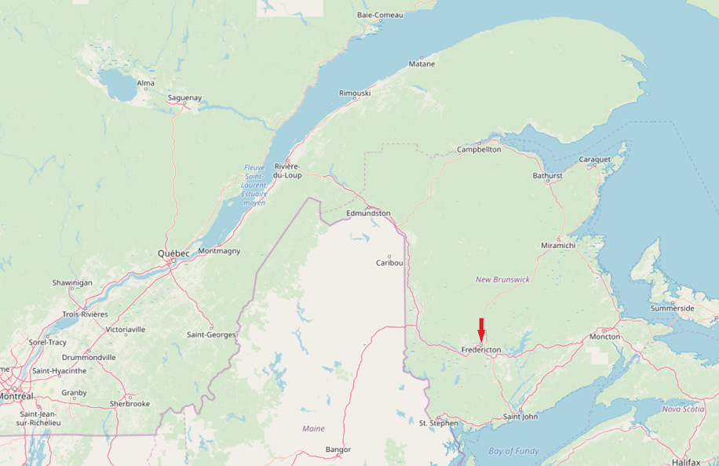
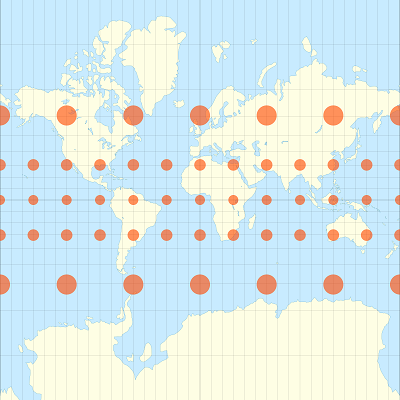
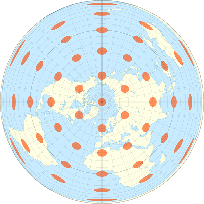
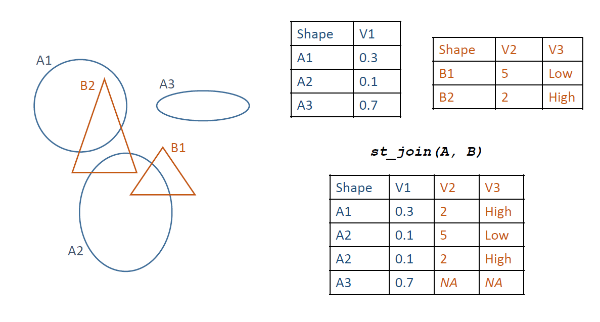
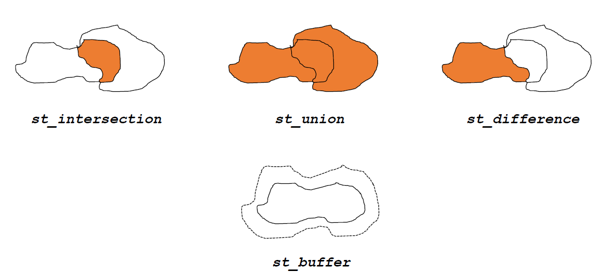

## Link to workshop content

http://pmarchand1.github.io/rgeo-csee2019

## Geospatial data

* Becoming increasingly common in various fields (e.g. aerial photos, satellite imagery, census data, geolocated posts on social networks, etc.).

* Raster data: variables defined at every point of a grid covering the full extent of the data, e.g. satellite images.

* Vector data: variables (attributes) associated to discrete geometrical objects (features) located in space, e.g. position of cities and highways on a road map.

## Why R?

At first, using programming commands to process geographical data can seem less intuitive, compared with the graphical user interface of GIS software. 

A few advantages of scripted analyses: 

* It is easy to repeat the analysis for new data by re-running the script.

* It is easy for other researchers to reproduce the methods if they have access to the same programming language.

* When using R specifically, the spatial data can be extracted and merged with other datasets for statistical analyses in a single programming environment.

## Objectives

* Become familiar with the main packages for processing and simple visualization of vector and raster data in R (the ***sf*** and ***stars*** packages, respectively).

* Perform common data transformation operations using functions from those packages.

* Create more complex static maps (with ***ggplot2***) and interactive maps (with ***mapview***).

## You are here

## Explore a vector dataset

* Read vector datasets into R. 

* Visualize variables on a map.

* Manipulate spatial data frames with ***dplyr***.

## Explore a vector dataset

* Spatial vector data associate data fields to localized geometric features such as points, lines and polygons. The ***sf*** package can be used to work with those datasets in R.

* To read a vector dataset: `st_read`.

* To convert a regular `data.frame` into a spatial object: `st_as_sf`.

* All basic `data.frame` operations, as well as ***dplyr*** package operations, also apply to `sf` objects.

* The `plot` function applied to an `sf` object displays one or many data fields on a map.

## Coordinate reference systems and transformations

* Geographic coordinates (longitude and latitude, in degrees): require a geodetic reference or *datum*.

* Planar or projected coordinates (in metres): require a geographic coordinate system as well as a projection.

* Impossible to provide exact representation of curved surface on plane. Different projections are adapted to specific regions or particular needs.

## Coordinate reference systems and transformations

Example:

* Red circles represent regions of the same size and shape on the Earth's surface.

* Mercator projection (left): preserves shape, but distorts size.

* Lambert equal-area projection (right); preserves area, but distorts shape.

 

## Coordinate reference systems and transformations

* Check the coordinate system: `st_crs`.

* Transform coordinates from one CRS to another: `st_transform`.

## Customize maps with ggplot2

* Basic structure of `ggplot` graphics.

* Display one or more spatial layers on a map.

* Change coordinate systems and add labels to the map.

## Customize maps with ggplot2

* Elements of a ***ggplot2*** graph: call to the `ggplot()` function, specific `geom` defining each graph layer, optional customization functions. 

* The `data` argument specifies a dataset and the `aes` function associates variables in that dataset to graphical elements. 

* `data` and `aes` can be defined in the `ggplot` function (if they apply to all layers) on in specific `geom` layers.

* `geom_sf`: create map from `sf` object. 

* `geom_sf_text` or `geom_sf_label`: add text to each spatial feature on a map.

* `coord_sf`: define axis limits and the CRS to use, transforming all spatial features to that CRS.

## Geometric operations on vector data

Three main types:

* predicates, which output TRUE or FALSE (e.g. is geometry A inside B?);

* measures, which produce a scalar quantity (e.g. length of a line, area of a polygon, distance between two geometries);

* geometry-generating functions, which produce output geometries based on input (e.g. distance buffer around a point, centroid of a polygon, intersection of two lines or polygons).

## Geometric operations on vector data

## Geometric operations on vector data

## Geometric operations on vector data

* Measure functions for the area of polygons (`st_area`), the length of a line (`st_length`) or the distance between pairs of geometric features (`st_distance`): those functions work with either geographic (long, lat) or projected coordinate systems.

* All other geometric operations in ***sf*** are based on planar geometry.

* Spatial predicate e.g. `st_intersects(A, B)`: for each feature in *A*, the function returns the indices of features with *B* that intersect with it.

* `st_join(A, B)` takes an `sf` object *A* and appends the data fields from a second object *B* for each case where the feature in *A* intersects with a feature in *B*. 

## Geometric operations on vector data

* `st_intersection(A, B)` produces a dataset containing all regions where features in *A* and *B* overlap.

* `st_difference(A, B)` produces a dataset containing the set differences (portion of *A* not in *B*) for each pair of features in *A* and *B*.

* `st_union(A, B)` produces a dataset containing the unions (area covered by either *A* or *B*) for each pair of features in *A* and *B*; or, with a single input object, merges all features in that object.

* `st_buffer` produces new geometric features that buffer the input features by a given distance.

## Raster datasets

* Read and visualize raster data.

* Crop and transform rasters.

* Extract variables from rasters based on a set of input points.

## Raster datasets

* `read_stars` loads a raster file in R. Specify `proxy = TRUE` to avoid loading the full raster in memory.

* A `stars` object can be plotted by itself with `plot`, or added to a `ggplot` with `geom_stars`.

* `filter` crops a `stars` object along the specified dimensions, `st_crop` crops it within the boundaries of an `sf` object.

* Arithmetic (`+`, `-`, etc.) and comparison operators (`<`, `==`, etc.) are applied to each pixel of the `stars` object.

* The `extract` function from the ***raster*** package extracts raster values at specific points specified by an `sf` object.

## Interactive maps with mapview

* `mapview(data)` where `data` is a raster or vector dataset.

* Add multiple layers as `mapview(data1) + mapview(data2)`.

* For vector datasets, specify data field to show on plot with `zcol` argument.

## Additional references

* The R-spatial blog ([https://www.r-spatial.org](https://www.r-spatial.org)) for news and tutorials on spatial packages in R. Also hosts the free textbook *Spatial Data Science* (Pebesma and Bivand) that covers the ***sf*** and ***stars*** package in more detail.

